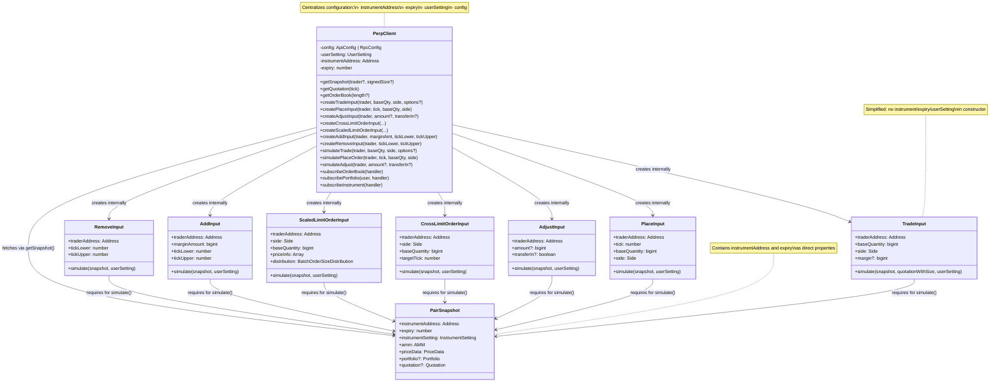

# xxInput Design Diagram

## Current Design (Before PerpClient)

### Architecture Overview


## Proposed Design (With PerpClient)

### Architecture Overview



## Data Flow Comparison

### Current Flow (Verbose)


### Proposed Flow (Clean)


## Key Benefits

1. **Single Source of Truth**: `userSetting`, `instrumentAddress`, `expiry` set once in `PerpClient`
2. **Less Repetition**: No need to pass same parameters repeatedly
3. **Type Safety**: Can't accidentally mix different instruments/expiries
4. **Cleaner API**: Methods only need operation-specific parameters
5. **Better Caching**: Can cache snapshots/quotation per pair
6. **WebSocket Integration**: Subscriptions naturally scoped to pair

## Usage Example Comparison

### Before (Current)

```typescript
const userSetting = new UserSetting(10, 10, 3n * WAD, 1);
const snapshot = await fetchOnchainContext(instrumentAddress, PERP_EXPIRY, rpcConfig, traderAddress);
const snapshotWithQuotation = await fetchOnchainContext(
    instrumentAddress,
    PERP_EXPIRY,
    rpcConfig,
    traderAddress,
    signedSize
);
const quotation = snapshotWithQuotation.quotation!;
const quotationWithSize = new QuotationWithSize(signedSize, quotation);

const tradeInput = new TradeInput(instrumentAddress, PERP_EXPIRY, traderAddress, baseQuantity, Side.LONG, userSetting);
const [param, sim] = tradeInput.simulate(snapshot, quotationWithSize);
```

### After (With PerpClient)

```typescript
const client = new PerpClient(rpcConfig, new UserSetting(10, 10, 3n * WAD, 1), instrumentAddress, PERP_EXPIRY);

const [param, sim] = await client.simulateTrade(traderAddress, baseQuantity, Side.LONG);
```
